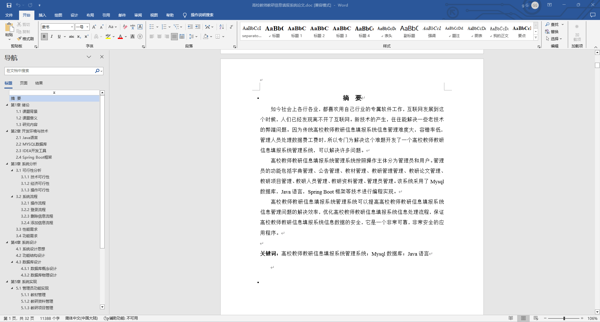
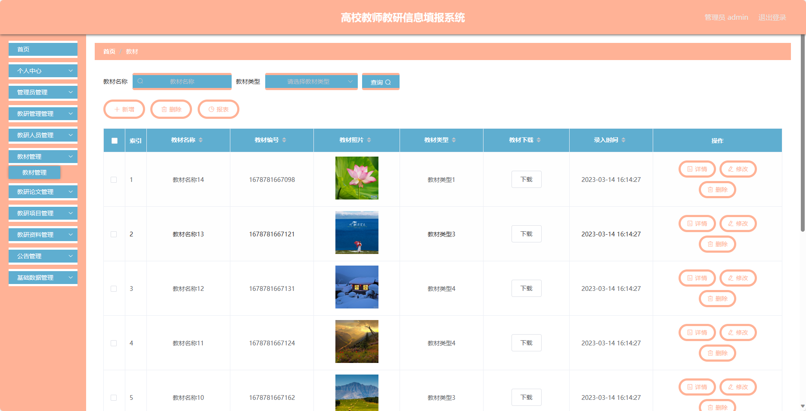
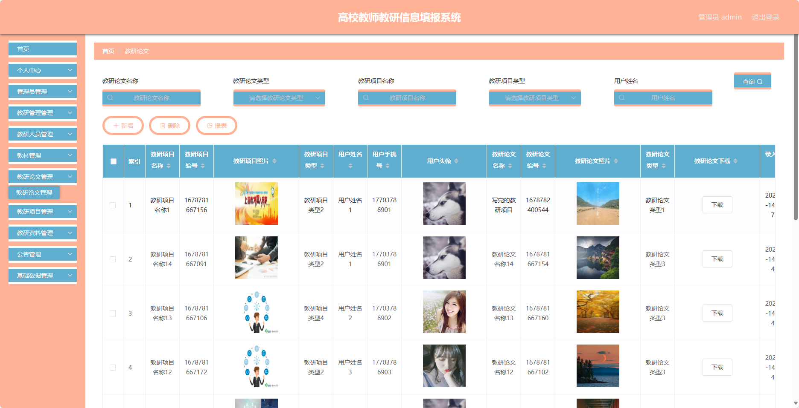
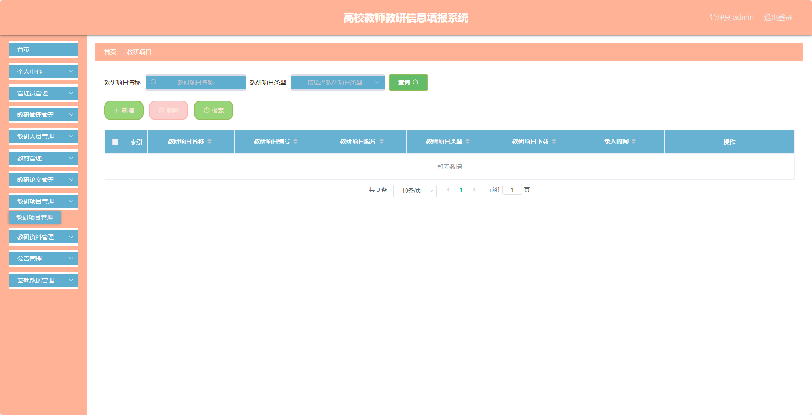
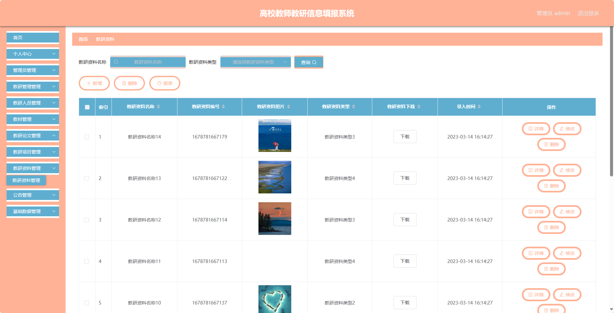
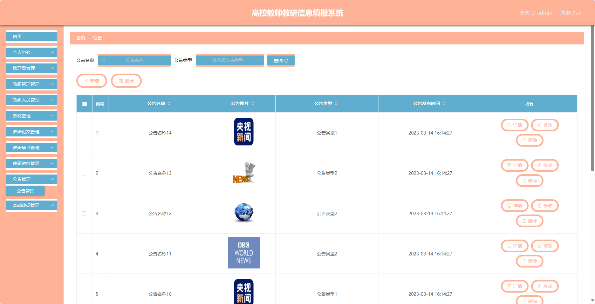
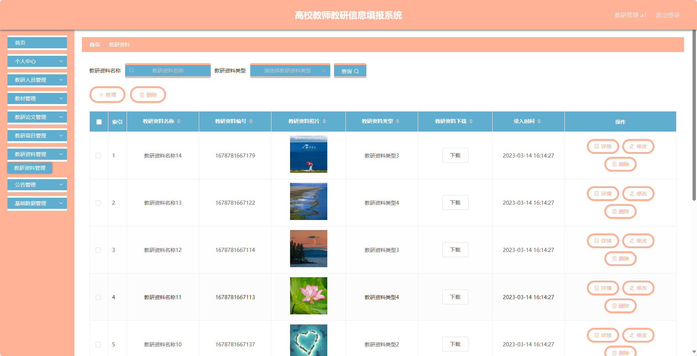
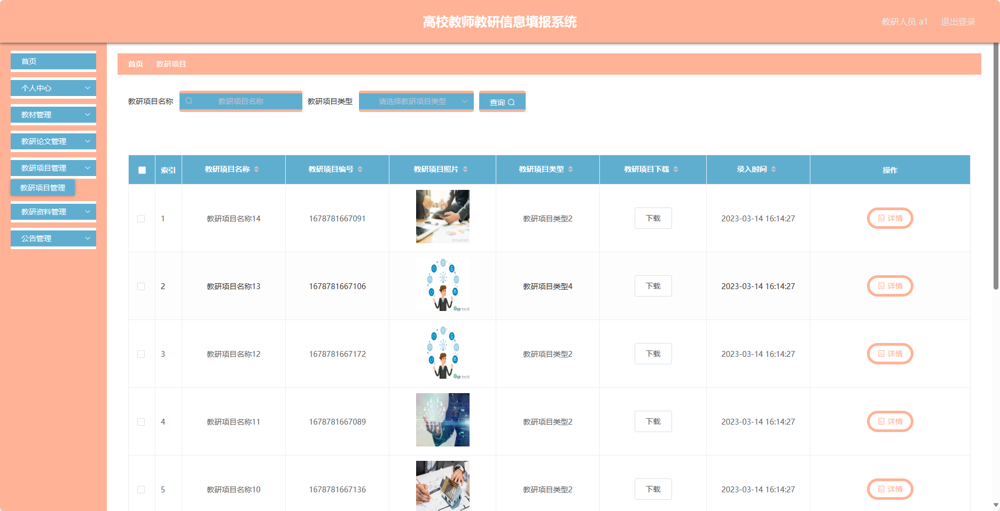
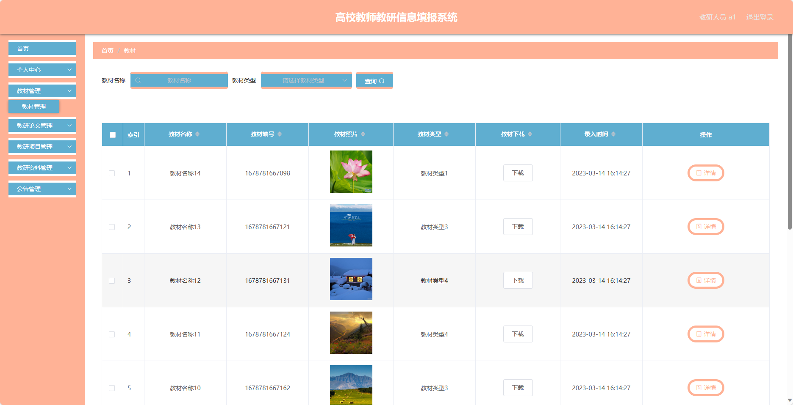

## 基于SpringBoot的高校教师教研信息填报系统(程序+报告)

###  获取sql数据库文件: 从戎源码网 (https://armycodes.com/) QQ: 386869957 QQ群: 377586148
###  所有系统地址: (https://github.com/YuLin-Coder/AllProjectCatalog) 
###  所有项目以及源代码本人均调试运行无问题 可支持远程安装部署调试、定制修改、代码讲解

## 项目介绍
基于SpringBoot的高校教师教研信息填报系统，系统包含三种角色：管理员、教研人员、教研管理,主要功能如下。

### 【管理员】:
1. 个人中心：管理员可以管理个人信息，包括修改密码、查看个人资料等。
2. 管理员管理：管理员可以对其他管理员进行管理，包括添加、编辑、删除管理员账号等操作。
3. 教研管理管理：管理员可以管理教研管理的相关信息，包括添加、编辑、删除教研管理等操作。
4. 教研人员管理：管理员可以管理教研人员的信息，包括添加、编辑、删除教研人员等操作。
5. 教材管理：管理员可以管理教材的信息，包括添加、编辑、删除教材等操作。
6. 教研论文管理：管理员可以管理教研论文的信息，包括添加、编辑、删除教研论文等操作。
7. 教研项目管理：管理员可以管理教研项目的信息，包括添加、编辑、删除教研项目等操作。
8. 教研资料管理：管理员可以管理教研资料的信息，包括添加、编辑、删除教研资料等操作。
9. 公告管理：管理员可以管理公告的发布和编辑，包括添加、编辑、删除公告等操作。
10. 基础数据管理：管理员可以管理系统的基础数据，包括教研分类、教材类型等的添加、编辑、删除等操作。

### 【教研管理】:
1. 个人中心：教研管理可以管理个人信息，包括修改密码、查看个人资料等。
2. 教研人员管理：教研管理可以管理教研人员的信息，包括添加、编辑、删除教研人员等操作。
3. 教材管理：教研管理可以管理教材的信息，包括添加、编辑、删除教材等操作。
4. 教研论文管理：教研管理可以管理教研论文的信息，包括添加、编辑、删除教研论文等操作。
5. 教研项目管理：教研管理可以管理教研项目的信息，包括添加、编辑、删除教研项目等操作。
6. 教研资料管理：教研管理可以管理教研资料的信息，包括添加、编辑、删除教研资料等操作。
7. 公告管理：教研管理可以管理公告的发布和编辑，包括添加、编辑、删除公告等操作。
8. 基础数据管理：教研管理可以管理系统的基础数据，包括教研分类、教材类型等的添加、编辑、删除等操作。

### 【教研人员】:
1. 个人中心：教研人员可以管理个人信息，包括修改密码、查看个人资料等。
2. 教材管理：教研人员可以管理教材的信息，包括添加、编辑、删除教材等操作。
3. 教研论文管理：教研人员可以管理教研论文的信息，包括添加、编辑、删除教研论文等操作。
4. 教研项目管理：教研人员可以管理教研项目的信息，包括添加、编辑、删除教研项目等操作。
5. 教研资料管理：教研人员可以管理教研资料的信息，包括添加、编辑、删除教研资料等操作。
6. 公告管理：教研人员可以管理公告的发布和编辑，包括添加、编辑、删除公告等操作。

## 项目技术
- 编程语言：Java
- 数据库：MySQL
- 项目管理工具：Maven
- 前端技术：HTML、CSS、JavaScript、Jquery、Vue
- 后端技术：Spring、SpringMVC、MyBatis

## 运行环境
- JDK版本：JDK1.8及以上
- 开发工具：IDEA、Ecplise、Myecplise都可以
- 数据库: MySQL5.7及以上
- Maven：maven3.0及以上
- Node：14.14.0及以上

## 运行截图

